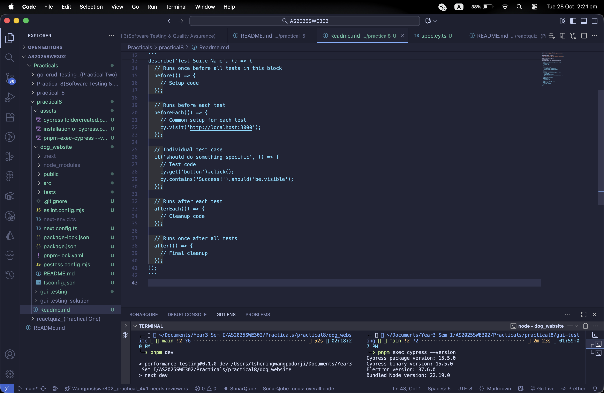
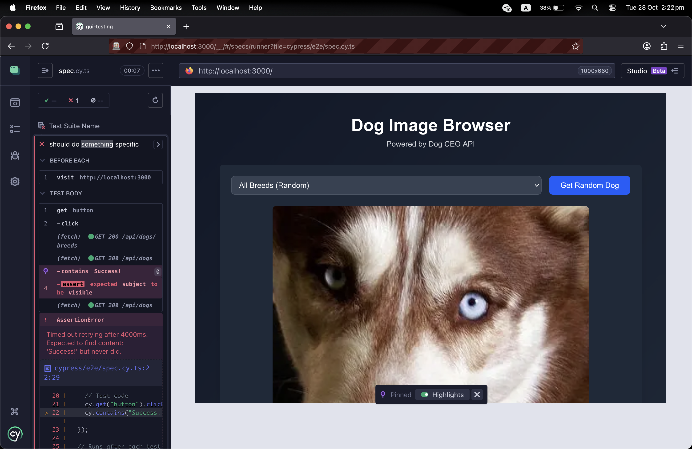

step 1 installation of cypress 


pnpm exec cypress --version


Understanding Cypress Basics
Test Structure
A typical Cypress test follows this structure:
```
describe('Test Suite Name', () => {
  // Runs once before all tests in this block
  before(() => {
    // Setup code
  });

  // Runs before each test
  beforeEach(() => {
    // Common setup for each test
    cy.visit('http://localhost:3000');
  });

  // Individual test case
  it('should do something specific', () => {
    // Test code
    cy.get('button').click();
    cy.contains('Success!').should('be.visible');
  });

  // Runs after each test
  afterEach(() => {
    // Cleanup code
  });

  // Runs once after all tests
  after(() => {
    // Final cleanup
  });
});
```


the output of running cypress in the terminaland then getting the localhost page in the browser of tbhe dog website project



